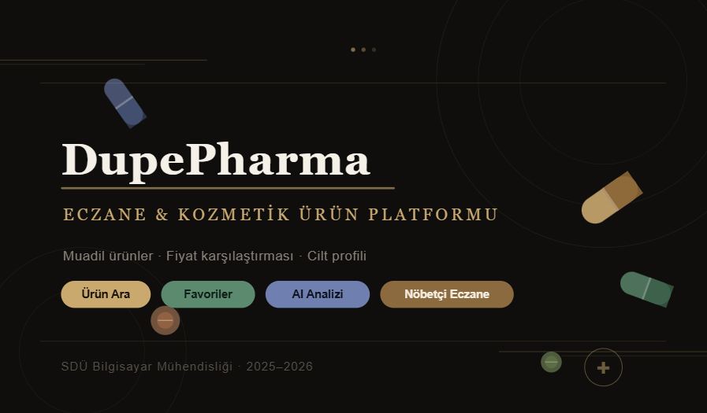

# DupePharma

---

## Proje Hakkında

**Proje Tanımı:** 

Eczane ve Kozmetik Muadil Sistemimiz, kullanıcıların sağlık ve kozmetik ürünlerine daha bilinçli ve kolay bir şekilde ulaşabilmesi için tasarlanmıştır. Platformumuz,
eczane ürünleri hakkında içerik bilgileri sunarken, kozmetik ürünler için uygun fiyatlı muadil alternatifler önererek kullanıcıların karşılaştırma yapmasına olanak sağlar.

Kullanıcı dostu arayüzümüz sayesinde ürün arama, içerik inceleme, favorilere ekleme ve yorum yapma işlemleri hızlı ve pratik bir şekilde gerçekleştirilebilir.Ayrıca 
nöbetçi eczane yönlendirme özelliği ile kullanıcılar o haftaki nöbetçi eczane bilgisine kolayca ulaşabilir.

Amacımız, güvenilir bilgi sunarak kullanıcıların doğru ürünü daha hızlı ve bilinçli bir şekilde seçmelerini sağlamaktır.

**Proje Kategorisi:** 
Muadil Ürün Öneri ve Bilgi Sistemi

---

## Proje Linkleri

- **REST API Adresi:** ilerde güncelelencek
- **Web Frontend Adresi:** https://dupe-pharma-vkej.vercel.app/

---

## Proje Ekibi

**Grup Adı:** 
Joker

**Ekip Üyeleri:** 
- Nazile Alıç
- Şadiye Berra Özelgül
- Menekşe Nazik
- Bahar Balım

---

## Dokümantasyon

Proje dokümantasyonuna aşağıdaki linklerden erişebilirsiniz:

1. [Gereksinim Analizi](Gereksinim-Analizi.md)
2. [REST API Tasarımı](API-Tasarimi.md)
3. [REST API](Rest-API.md)
4. [Web Front-End](WebFrontEnd.md)
5. [Mobil Front-End](MobilFrontEnd.md)
6. [Mobil Backend](MobilBackEnd.md)
7. [Video Sunum](Sunum.md)
